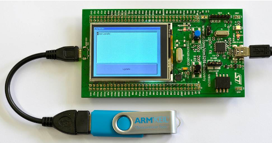

# Keil MDK-Middleware Proof-of-Concept

With the availability of more capable microcontrollers, software development for these devices has become more complex over the years. The use of real-time operating systems is rapidly becoming an industry "best practice", and integration of commercial middleware as well as the reuse of custom libraries is gaining importance for cost-efficient software engineering. Successfully combining these building blocks of a modern embedded application often poses a problem for developers.

To resolve this, Arm developed the [Common Microcontroller Software Interface Standard (CMSIS)](ttps://arm-software.github.io/CMSIS_6/latest/General/html/index.html).

## The Application

This tutorial shows how to read the contents of a text file from a USB memory stick attached to a development board. After pressing an update button on the touch screen, the content is shown on the LCD. It is based on [application note 268](https://developer.arm.com/documentation/kan268/latest) and was converted to work with [CMSIS-Toolbox 2.0.0](https://github.com/Open-CMSIS-Pack/cmsis-toolbox) in [Keil Studio](https://keil.arm.com).

The application note explains the required steps to create the application on an [STM32F429I-Discovery](https://www.st.com/en/evaluation-tools/32f429idiscovery.html) board. Still, it can be easily ported to other underlying hardware using [MDK-Middleware](https://developer.arm.com/Tools%20and%20Software/Keil%20MDK/MDK-Middleware), [Keil RTX5](https://developer.arm.com/dev2/Tools%20and%20Software/Keil%20MDK/RTX5%20RTOS) and CMSIS.

